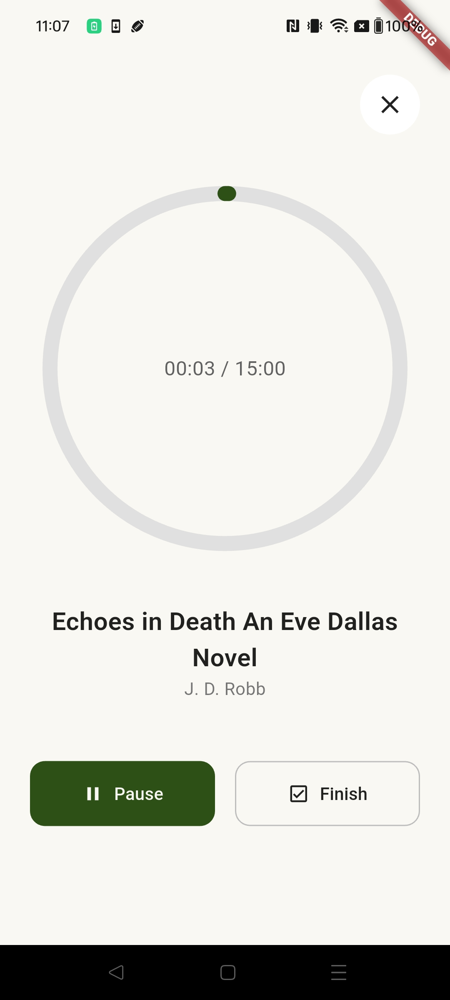
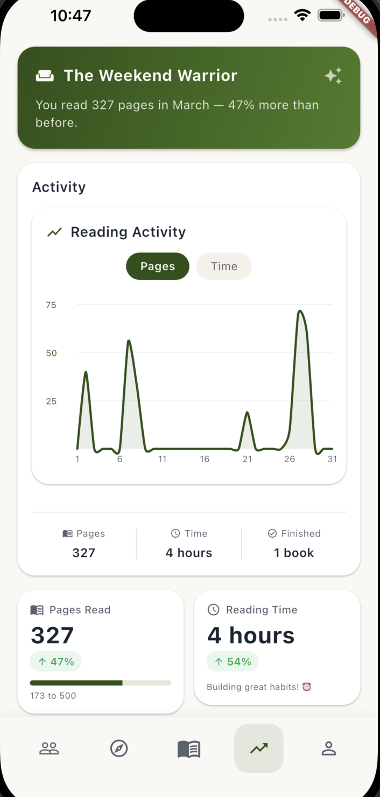
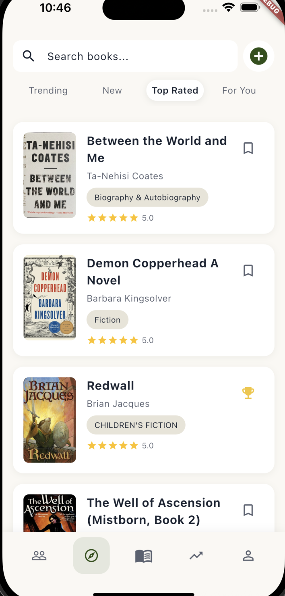
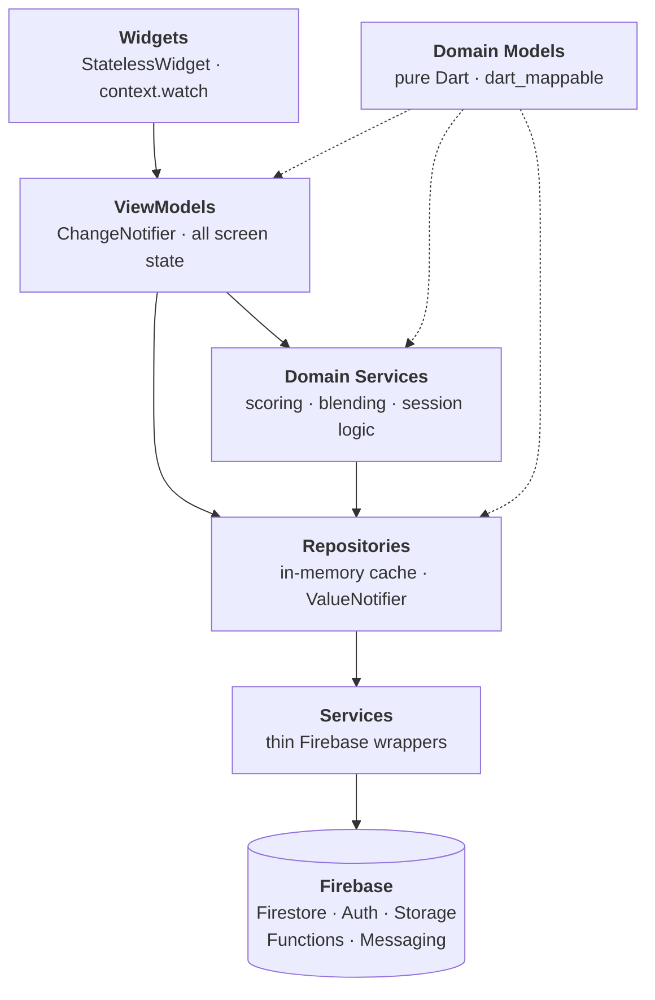

<div align="center">


# Wovyn

**A full-stack mobile reading platform built with Flutter and Firebase.**

Track reading sessions, discover books through a personalized ranked feed,
and see your habits build over time.

[](https://flutter.dev)
[](https://dart.dev)
[](https://firebase.google.com)
[](https://nextjs.org)
[](https://testflight.apple.com/join/ZqyGzZQX)

[**Website**](https://wovyn-landing.vercel.app/) · [**Join the TestFlight beta**](https://testflight.apple.com/join/ZqyGzZQX)

</div>

---

<div align="center">
<table>
<tr>
<td align="center" width="33%"><br /><sub><b>Active session</b><br />Wall-clock timer that survives a cold start</sub></td>
<td align="center" width="33%"><br /><sub><b>Stats</b><br />Pages, time, streaks, and goal history</sub></td>
<td align="center" width="33%"><br /><sub><b>Explore</b><br />Ranked discovery and search</sub></td>
</tr>
</table>
</div>

---

## What it is

Wovyn is a mobile reading platform for people who take the habit seriously. It tracks
reading progress session by session, surfaces books through a feed ranked on your own
reading behaviour rather than a raw follow graph, and turns the resulting history into
stats worth looking at.

It is a solo-built production system: iOS and Android client, Firebase backend, scheduled
recommendation jobs, security rules, and release pipeline — all of it mine.

### By the numbers

| | |
|---|---|
| **44,885** | lines of hand-written Dart (excludes generated serialization code) |
| **191** | Dart source files across **33** feature modules |
| **24** | Cloud Functions — triggers, callables, and scheduled jobs |
| **30+** | TestFlight beta testers giving real usage feedback |

---

## Features

| Feature | What it does |
|---|---|
| **Personalized feed** | Events ranked by an 8-signal scoring model, then re-ordered for diversity |
| **Reading sessions** | Persistent timed sessions with progress tracking and recovery across app restarts |
| **Book discovery** | Algolia-backed search plus generated "For You" recommendations and trending lists |
| **Real-time sync** | Live updates across devices, with offline writes that replay safely |
| **Profiles & stats** | Reading activity grid, daily goals, streaks, pace, and history |
| **Social layer** | Friends, accountability partners, reviews, likes, and an activity feed |

---

## Architecture

Strict MVVM with four layers. Dependencies only ever point downward — widgets never
reach past their ViewModel, and nothing below the UI layer imports Flutter.



Two conventions hold the whole thing together:

- **Nothing below the UI layer throws.** Every repository and service method returns a
  `Result<T>`, handled with an exhaustive `switch` at the call site. Error paths are part
  of the type, not an afterthought.
- **State propagates through notifiers, not rebuilds.** Repositories own in-memory state
  and expose granular `ValueNotifier`s; ViewModels subscribe to only the ones they need
  and unsubscribe on dispose. A username change repaints the widgets bound to it and
  nothing else.

---

## Engineering highlights

### Feed ranking

Every feed event is scored against the viewer, not just sorted by recency. Eight signals
contribute, each with a bounded range so no single factor can dominate:

| Signal | Range | Source |
|---|---|---|
| Signal weight | 0–10 | Event type importance (finished > review > saved) |
| Quality score | −2–5 | Book's global rating and engagement; negative is a penalty |
| Taste score | 0–8 | Match against a computed taste profile (subject weights, authors read, typical length) |
| Social score | 0–8 | Friends plus a "people like you" collaborative overlap signal |
| Engagement | 0–3 | Like count |
| Trending | 0–3 | Community read/save momentum |
| Randomness | 0–1 | Tie-breaking and freshness |
| Recency | ×0.3–1.0 | Time decay applied to the total |

A hard quality filter drops books with no community engagement before scoring. Scored
events then pass through a **blending stage** that enforces diversity inside a sliding
window — at most 2 events from one user, 1 book per author, 2 books sharing a subject —
and injects an off-profile book every 5 items so the feed keeps discovering instead of
narrowing.

*`lib/domain/services/feed_scoring_service.dart`, `feed_blending_service.dart`*

### Reading sessions that actually persist

A reading session survives navigating away, backgrounding, and cold-killing the app. The
timer is wall-clock based — elapsed time is computed from timestamps rather than
accumulated ticks, so it stays correct whether or not the app was alive. Built in three
layers:

1. **State persistence** — active session serialized to local storage, restored on launch, with a "now reading" banner above the bottom nav.
2. **Local notifications** — ongoing session surfaced at the OS level.
3. **iOS Live Activity** — live progress on the Lock Screen and in the Dynamic Island.

### Offline-safe writes

Firestore replays queued writes when connectivity returns, which makes non-idempotent
writes a real correctness problem rather than a theoretical one. The data layer is built
for it:

- Document ids are **generated client-side** (`.doc(uuid).set(...)`, never `.add(...)`), so a replayed write overwrites rather than duplicates.
- Cloud Function triggers dedupe through a `claimEvent(eventId, scope)` helper, making retried invocations safe.
- Counter aggregations using `FieldValue.increment` are explicitly *not* retried app-side — the SDK's own replay is safe, ad-hoc retry loops are not.
- A pending-writes service wraps `waitForPendingWrites()` to drive a sync indicator and to guard sign-out against dropping unsynced data.

### Scheduled backend work

Recommendation and discovery lists are generated server-side on a schedule rather than
computed on every request: a weekly per-user "For You" job, plus trending, top-rated, and
new-release list builders, each with retry and timeout budgets. Callable variants exist
for manual refresh and testing.

---

## Tech stack

| Layer | Stack |
|---|---|
| **Mobile client** | Flutter · Dart · go_router · provider · rxdart |
| **Serialization** | dart_mappable (code-gen, no hand-written `fromJson`) |
| **Backend** | Firebase — Firestore, Auth, Storage, Cloud Functions (Node), Messaging, Crashlytics, Analytics |
| **Search** | Algolia |
| **Testing** | flutter_test · mocktail · fake_cloud_firestore · Firebase emulator suite · Jest for security rules |
| **This site** | Next.js 16 · React 19 · TypeScript · Tailwind CSS 4 · Vercel |

---

## About this repository

This repo holds the source of the **Wovyn marketing site** — the Next.js 16 / React 19 /
Tailwind 4 landing page deployed at [wovyn-landing.vercel.app](https://wovyn-landing.vercel.app/).

The **Flutter application source is a private, closed-source repository** and stays that
way — Wovyn is a commercial product. Everything described above comes from that codebase,
and I'm glad to walk through the architecture and implementation in detail in conversation.

```bash
npm install
npm run dev     # http://localhost:3000
```

---

## Status

In **TestFlight beta** with 30+ testers, shipping iteratively against real usage feedback.
App Store release in progress.

**Contact** — [LinkedIn](https://www.linkedin.com/in/connorflynn-dev/)

<sub>© 2026 Connor Flynn. All rights reserved. Wovyn is a commercial product — this
repository is published for reference, not for reuse. No license is granted to the code,
screenshots, branding, or the Wovyn name.</sub>
